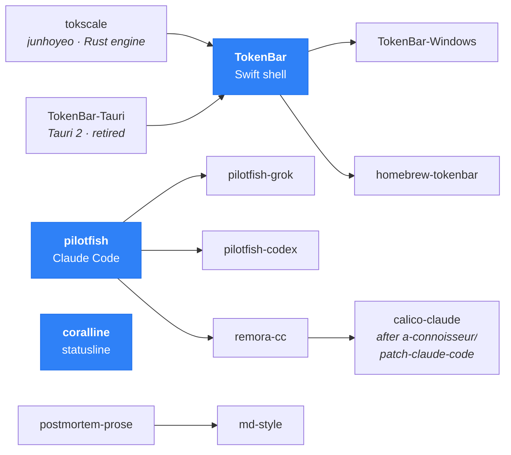

<!--
  ╭─ hey, you opened the raw file ─────────────────────────────╮
  │  Most of this page rebuilds itself every night:            │
  │  scripts/update_readme.py + .github/workflows/readme.yml   │
  │  The numbers below are not decoration. They are the build. │
  ╰────────────────────────────────────────────────────────────╯
-->

<!-- NEOFETCH:START -->
```console
╭─ nanako@taiwan ─────────────────────────────────────────────────────────────────────────╮
│                                                                                         │
│          w*aw                   kok                                                     │
│         m8BB8Mk              Za8BB%*       nanako@taiwan                                │
│         *%B@@#akwwqpdbkkbqwmdh*@@@B&       ─────────────                                │
│         8%*ooo#MWWWWWWWWWWMM#oahaaB%Z      Name: Nanako, or Nyanako                     │
│        Za*##MWWWWWW&&&&88&&&&WW#*oaaw      Pronouns: she / her                          │
│       q*MWWWW&&88888888888%8888&WMMMop     OS: macOS 26.5.2 arm64                       │
│      oW&8WWM/M/)&%%%%%%%%%%*)&rC&888WMa    Host: MacBook Air (M5, 2026), 32GB / 1TB     │
│     h---*W&<>|<<(%B%%%%%%%8+<|+<(8W#---k   Kernel: SRE, platform & DevSecOps            │
│     #----M&&&88%%%%%%%%%%%%%%%8888M----*   Uptime: 27 years                             │
│     h---8bW&&&&888%%%%%%%%%888888*&8---h   Install Date: 2018-11-04 (github.com)        │
│      oW&fW&8&888888888888888888&&&oM8&o    Packages: 24 sources (git), 1,442 stars      │
│       daM&&&888888888888888888888&&M#op    Shell: zsh + powerlevel10k                   │
│        h**MMW&&&&8&8&888&8&&&&&&WM#M&8M    DE: coralline (Claude Code statusline)       │
│       mhM8%%BB%%88&88&&&888%BBBBB%8%h8#    Homelab: Proxmox, 212d up, 0 open ports      │
│        dW88%%%88&&&8$$$$W8%88%%88&M*h&     CPU: Rust, Swift, Python, Ansible, K8s       │
│        mM&8%BB%8&W&&$@$MW8BBB%B88&Mk       Locale: zh_TW.UTF-8 (English via translator) │
│         b*&8%%%8%%8  $$BM&8888%88Ma                                                     │
│            M88%%%         &88%%8           Now: no roadmap. What I ship, I maintain.    │
│                                                                                         │
╰─────────────────────────────────────────────────────────────────────────────────────────╯
```
<!-- NEOFETCH:END -->

```console
~ ❯ cat about.md
```

Nanako (菜菜子), or Nyanako (喵菜子) if you know me from Discord. I'm an SRE. Keeping
systems reliable is the day job — the projects here are the same instinct pointed
somewhere else.

**UX has frontend engineers. DX has SRE.** That's the thread running from my work into
everything on this page.

Every one of these started because I needed it. TokenBar exists because I wanted to know
what a session actually cost without opening a dashboard. coralline exists because I've
used Powerlevel10k in zsh for years and wanted the same thing in my Claude Code
statusline — I only packaged it up because people kept asking how I'd done it.

That's the whole pattern: I build it for myself, I share it because sharing is the good
part, and once it's public I maintain it properly. What comes next is genuinely unknown —
whatever I hit while learning, whatever annoys me enough to open a new repo. That's the
roadmap.

> The full story of the TokenBar rewrite — Rust core, Swift shell, and the FFI seam
> between them — is written up here (zh-TW):
> **[Rust 的引擎，Swift 的外殼](https://hackmd.io/@Nyanako0129/tokenbar-rust-swift-ffi-zh)**

```console
~ ❯ ls -l ~/projects --sort=stars
```

<!-- PROJECTS:START -->
| Project | What it is | Stars | Latest | Downloads | Updated |
| :-- | :-- | --: | :-- | --: | :-- |
| **[pilotfish](https://github.com/Nanako0129/pilotfish)** | Multi-model orchestration for Claude Code | ★ 579 | `v1.3.8` | — | 1d ago |
| **[coralline](https://github.com/Nanako0129/coralline)** | Powerlevel10k-inspired statusline for Claude Code | ★ 534 | `v0.13.0` | — | 1d ago |
| **[TokenBar](https://github.com/Nanako0129/TokenBar)** | Native macOS menu-bar monitor for AI token usage | ★ 240 | `v1.12.0` | 4.3k | today |
| **[remora-cc](https://github.com/Nanako0129/remora-cc)** | Session-scoped GPT-5.6 agent routing | ★ 25 | `v0.1.17` | 90 | 4d ago |
| **[SocksBypass](https://github.com/Nanako0129/SocksBypass)** | SOCKS5 proxy for iOS, built to defeat tethering limits | ★ 28 | `v0.1.0` | 1 | 1d ago |
| **[postmortem-prose](https://github.com/Nanako0129/postmortem-prose)** | zh-TW tech longform in a postmortem voice | ★ 4 | `—` | — | 25d ago |
<!-- PROJECTS:END -->

```console
~ ❯ tokscale models --week --group-by model
```

> Real usage, pushed here nightly by a cron job on my Mac. The numbers come from
> [tokscale](https://github.com/junhoyeo/tokscale) — junhoyeo's Rust engine for reading
> agent session data, and the engine [TokenBar](https://github.com/Nanako0129/TokenBar)
> runs on. I send fixes upstream when I trip over them; the Swift shell around it is my
> part. Grouped by model rather than by client, because the client would lie: I drive
> GPT models through Claude Code.

<!-- USAGE:START -->
```console
last 7 days · 5.9B tokens · 35,711 messages

  gpt-5.6-sol         ██████████░░░░░░░░░░░░  45.9%     2724M
  claude-opus-5       ████████░░░░░░░░░░░░░░  38.6%     2291M
  gpt-5.6-luna        ███░░░░░░░░░░░░░░░░░░░  11.8%      702M
  claude-sonnet-5     █░░░░░░░░░░░░░░░░░░░░░   2.7%      158M
  codex-auto-review   ░░░░░░░░░░░░░░░░░░░░░░   0.9%       51M
  claude-haiku-4-5    ░░░░░░░░░░░░░░░░░░░░░░   0.2%       12M
```
<!-- USAGE:END -->

```console
~ ❯ git log --oneline --author=nanako -5
```

<!-- NOW:START -->
```console
2026-08-05  TokenBar            fix(discord): a write that skips the publish floor must no
2026-08-05  TokenBar            fix(discord): close-on-exec at birth; a connect deadline t
2026-08-05  TokenBar            fix(discord): separate what the user wants from what the s
2026-08-05  TokenBar            fix(discord): a clear is not a new sample, and stop() must
2026-08-05  TokenBar            fix(discord): bring the presence back after the connection
```
<!-- NOW:END -->

```console
~ ❯ tree ~/projects --lineage
```



```console
~ ❯ ssh homelab -- uptime
```

The same discipline, off the clock — everything below runs at home:

```console
Proxmox VE      212d uptime · every service in Compose, every service healthchecked
Zero trust      Cloudflare Tunnel + Access · 5 tunnels · 20 ZTNA apps · 0 inbound ports
Home Assistant  141 integrations · 369 entities · 53 devices · one Lovelace panel
Self-hosted     Immich · Nextcloud AIO · LiteLLM · Open-WebUI · n8n · TrueNAS
Observability   Prometheus · Grafana · Loki · Tempo · OpenTelemetry · eBPF
```

```console
~ ❯ ssh nyanko.home
```

### 卯咪卯的窩 · a Chinese-speaking dev community

[](https://discord.gg/HD8GzXzBEu)

我一直想要一個地方：能認真聊技術，也能放心做自己。找不到，那就自己開一個。

- 💻 **技術控** — agentic coding、熱門 AI 應用、開源工具、軟體開發、DevOps／SRE。想深聊、想求救、想炫專案都可以。
- 💬 **只想交朋友、放鬆閒聊** — 完全歡迎，不用很懂技術。
- 🏳️‍⚧️ **秘密專區** — 我自己是跨女，所以特別開了一區給跨性別、偽娘／男娘：安心做自己、和姐妹聊女裝、交朋友、談談心事。

不管你是哪一種（或同時是好幾種），這裡都有你的位置。沒有門檻，潛水歡迎。

**[→ 進來坐](https://discord.gg/HD8GzXzBEu)**

```console
~ ❯ cat .offline
```

```console
Coffee      Sunbeam Barista Max + Option-O Lagom Casa
            nutty / chocolate base, with the occasional fruit bomb
Hamsters    once shared my life with two hamsters — 877 and 907 days, respectively.
Headphones  Sony IER-M9 · MDR-MV1 · MDR-M1 · iFi xDSD Gryphon
```

```console
~ ❯ patreon --thanks
```

If any of this saved you time or money, a membership keeps the cron jobs running.

[](https://www.patreon.com/cw/Nanako0129/membership)

```console
~ ❯ contact
```

**Something broken, or an idea for a feature** → open an issue on that repo. That's what
issues are for, and the answer helps the next person too. If a tool just made your day
easier and you want to say so there, that's welcome as well — I read every one.

**Anything formal** → email me at **nanakotsai@nyanako.com**.

**Anything casual** → the Discord above, DM me there, or find me on
[Threads](https://www.threads.com/@nyanako0129). My X account is private, so
that's not the way in.

A note on language: I'm a native Traditional Chinese speaker and my English isn't fluent —
some of my replies go through a translator. Chinese is very welcome, and please bear with
me in English.

```console
~ ❯ exit
```

<sub>This page rebuilds itself nightly · last sync: 2026-08-05 · <a href="https://github.com/Nanako0129/Nanako0129/blob/main/scripts/update_readme.py">how</a></sub>
