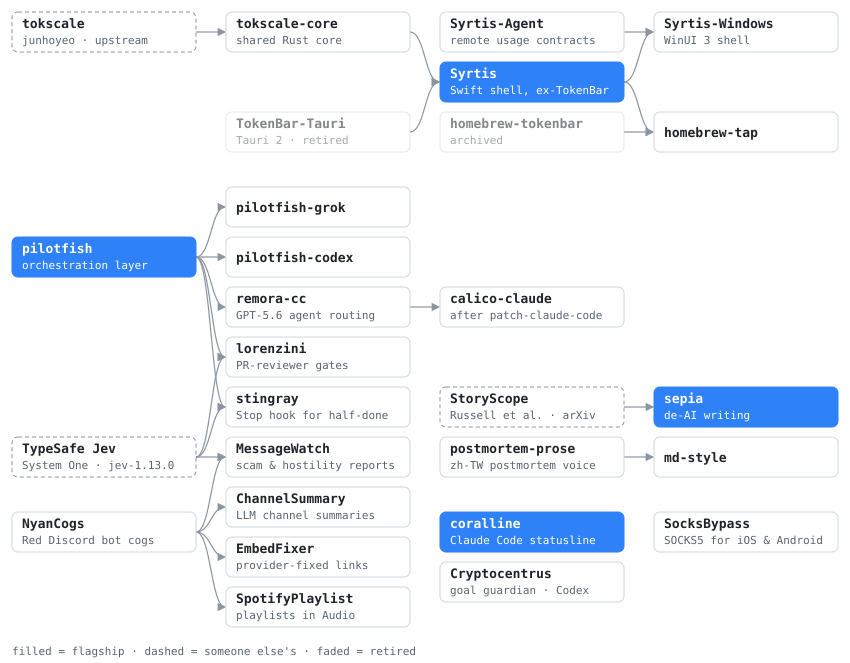

<!--
  ╭─ hey, you opened the raw file ─────────────────────────────╮
  │  Most of this page rebuilds itself every six hours:        │
  │  scripts/update_readme.py + .github/workflows/readme.yml   │
  │  The numbers below are not decoration. They are the build. │
  ╰────────────────────────────────────────────────────────────╯
-->

<!-- NEOFETCH:START -->
<p align="center"></p>
<!-- NEOFETCH:END -->

```console
~ ❯ cat about.md
```

Nanako (菜菜子), or Nyanako (喵菜子) if you know me from Discord. I'm an SRE. Keeping
systems reliable is the day job — the projects here are the same instinct pointed
somewhere else.

**UX has frontend engineers. DX has SRE.**

Every one of these started because I needed it. Syrtis (formerly TokenBar) exists
because I wanted to know what a session actually cost without opening a dashboard.
coralline exists because I've used Powerlevel10k in zsh for years and wanted the same
thing in my Claude Code statusline — I only packaged it up because people kept asking
how I'd done it.

I share it because sharing is the good part, and once it's public I maintain it properly.
What comes next is genuinely unknown — whatever I hit while learning, whatever annoys me
enough to open a new repo.

> The full story of the TokenBar rewrite (now Syrtis) — Rust core, Swift shell, and the
> FFI seam between them — is written up here (zh-TW):
> **[Rust 的引擎，Swift 的外殼](https://hackmd.io/@Nyanako0129/tokenbar-rust-swift-ffi-zh)**

```console
~ ❯ ls -l ~/projects --sort=stars
```

<!-- PROJECTS:START -->
| Project | What it is | Stars | Latest | Downloads | Updated |
| :-- | :-- | --: | :-- | --: | :-- |
| **[sepia](https://github.com/Nanako0129/sepia)** | De-AI writing skill for coding agents | ★ 2916 | `v0.12.2` | — | 6d ago |
| **[pilotfish](https://github.com/Nanako0129/pilotfish)** | Multi-model orchestration for Claude Code | ★ 698 | `v1.4.2` | — | 4d ago |
| **[coralline](https://github.com/Nanako0129/coralline)** | Powerlevel10k-inspired statusline for Claude Code | ★ 544 | `v0.18.1` | — | 4d ago |
| **[Syrtis](https://github.com/Nanako0129/Syrtis)** | Native macOS menu-bar monitor for AI token usage | ★ 387 | `v2.2.0` | 7.3k | today |
| **[SocksBypass](https://github.com/Nanako0129/SocksBypass)** | SOCKS5 proxy for iOS and Android, built to defeat tethering limits | ★ 79 | `—` | — | 22d ago |
| **[remora-cc](https://github.com/Nanako0129/remora-cc)** | Session-scoped GPT-5.6 agent routing | ★ 26 | `v0.1.23` | 71 | 11d ago |
| **[lorenzini](https://github.com/Nanako0129/lorenzini)** | PR-reviewer gates that decide whether a verdict means pass | ★ 17 | `v0.2.3` | — | 4d ago |
| **[postmortem-prose](https://github.com/Nanako0129/postmortem-prose)** | zh-TW tech longform in a postmortem voice | ★ 4 | `—` | — | 2mo ago |
<!-- PROJECTS:END -->

```console
~ ❯ tokscale models --week --group-by model
```

> Real usage, pushed here every six hours by a cron job on my Mac. The numbers come from
> [tokscale](https://github.com/junhoyeo/tokscale) — junhoyeo's Rust engine for reading
> agent session data, and the engine [Syrtis](https://github.com/Nanako0129/syrtis)
> runs on. I send fixes upstream when I trip over them; the Swift shell around it is my
> part. Grouped by model rather than by client, because the client would lie: I drive
> GPT models through Claude Code.

<!-- USAGE:START -->
```console
last 7 days · 8.3B tokens · 24,082 messages

  claude-opus-5-5     ██████████████████░░░░  80.6%     6692M
  claude-sonnet-5     ████░░░░░░░░░░░░░░░░░░  16.0%     1332M
  claude-opus-5       █░░░░░░░░░░░░░░░░░░░░░   2.4%      202M
  grok-4.7            ░░░░░░░░░░░░░░░░░░░░░░   0.7%       57M
  claude-haiku-4-5    ░░░░░░░░░░░░░░░░░░░░░░   0.1%       12M
  grok-4.6            ░░░░░░░░░░░░░░░░░░░░░░   0.1%        5M
```
<!-- USAGE:END -->

```console
~ ❯ git log --oneline --author=nanako -5
```

<!-- NOW:START -->
```console
2026-09-30  calico-claude       fix(patch): follow Claude 2.1.285's hoisted session header
2026-09-29  calico-claude       feat(patch): keep non-empty thinking out of collapsed read
2026-09-28  calico-claude       fix(patch): keep the clone-sync rewrite off string literal
2026-09-28  calico-claude       fix(patch): follow Claude 2.1.284's if-form clone sync
2026-09-28  syrtis              docs(landing): offer the notarized DMG on macOS; drop the 
```
<!-- NOW:END -->

```console
~ ❯ tree ~/projects --lineage
```

<p align="center"></p>

```console
~ ❯ ssh homelab -- uptime
```

The same discipline, off the clock — everything below runs at home:

```console
Proxmox VE      27d uptime · every service in Compose, every service healthchecked
Zero trust      Cloudflare Tunnel + Access · 6 tunnels · 20 ZTNA apps · 0 inbound ports
Home Assistant  140 integrations · 409 entities · 56 devices · one Lovelace panel
Self-hosted     Immich · Nextcloud AIO · LiteLLM · Open-WebUI · n8n · TrueNAS
```

```console
~ ❯ ssh nyanko.home
```

### 卯咪卯的窩 · a Chinese-speaking dev community

[](https://discord.gg/C6NRm5jHMt)

我一直想要一個地方：能認真聊技術，也能放心做自己。找不到，那就自己開一個。

- 💻 **技術控** — agentic coding、熱門 AI 應用、開源工具、軟體開發、DevOps／SRE。想深聊、想求救、想炫專案都可以。
- 💬 **只想交朋友、放鬆閒聊** — 完全歡迎，不用很懂技術。
- 🏳️‍⚧️ **秘密專區** — 我自己是跨女，所以特別開了一區給跨性別、偽娘／男娘：安心做自己、和姐妹聊女裝、交朋友、談談心事。

不管你是哪一種（或同時是好幾種），這裡都有你的位置。

**[→ 進來坐](https://discord.gg/C6NRm5jHMt)**

```console
~ ❯ cat .offline
```

```console
Coffee      Sunbeam Barista Max + Option-O Lagom Casa
            nutty / chocolate base, with the occasional fruit bomb
Hamsters    once shared my life with two hamsters — 877 and 907 days, respectively.
Headphones  Sony IER-M9 · MDR-MV1 · MDR-M1 · iFi xDSD Gryphon
```

```console
~ ❯ patreon --thanks
```

If any of this saved you time or money, a membership keeps the cron jobs running.

[](https://www.patreon.com/cw/Nanako0129/membership)

```console
~ ❯ contact
```

**Something broken, or an idea for a feature** → open an issue on that repo. That's what
issues are for, and the answer helps the next person too. If a tool just made your day
easier and you want to say so there, that's welcome as well — I read every one.

**Anything formal** → email me at **nanakotsai@nyanako.com**.

**Anything casual** → the Discord above, DM me there, or find me on
[Threads](https://www.threads.com/@nyanako0129) and [X](https://x.com/Nyanako0129).

A note on language: I'm a native Traditional Chinese speaker and my English isn't fluent —
some of my replies go through a translator. Chinese is very welcome, and please bear with
me in English.

```console
~ ❯ exit
```

<sub>This page rebuilds itself every six hours · last sync: 2026-09-30 · <a href="https://github.com/Nanako0129/Nanako0129/blob/main/scripts/update_readme.py">how</a></sub>
